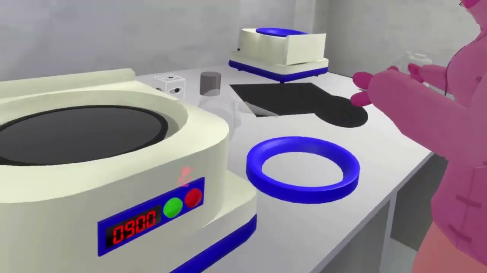
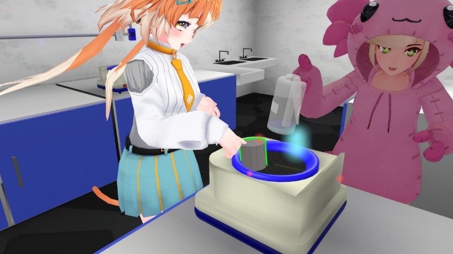
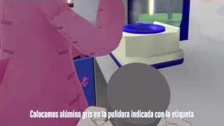
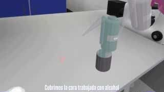
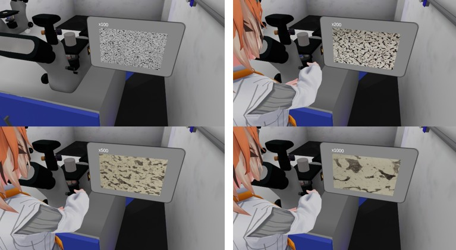

# Laboratorio Virtual para Ensayo Metalográfico

### *Desarrollo de un laboratorio virtual para efectuar un ensayo metalográfico*

Aplicación de **Realidad Virtual** desarrollada como mundo de **VRChat** que reproduce, de forma interactiva y con fidelidad procedimental, las etapas de un **ensayo metalográfico**:
desde el desbaste y pulido de una probeta metálica hasta su ataque químico y observación de la microestructura al microscopio.

Este proyecto constituye el desarrollo tecnológico asociado al trabajo de tesis **«Desarrollo de un laboratorio virtual para efectuar un ensayo metalográfico»** y fue realizado con el apoyo del **Programa de Apoyo a Proyectos para Innovar y Mejorar la Educación (PAPIME)** de la UNAM, con clave de proyecto **PE103324**.

<p align="left">
  
  
  
  
</p>

---

## Tabla de contenido

1. [Video demostrativo](#video-demostrativo)
2. [Visualizadores web complementarios](#visualizadores-web-complementarios)
3. [Descripción del proceso simulado](#descripción-del-proceso-simulado)
4. [Requisitos](#requisitos)
5. [Instalación y configuración](#instalación-y-configuración)
6. [Paquetes y dependencias adicionales](#paquetes-y-dependencias-adicionales)
7. [Uso](#uso)
8. [Estructura de carpetas](#estructura-de-carpetas)
9. [Créditos](#créditos)

---

## Video demostrativo

Demostración completa del recorrido por el laboratorio virtual y del procedimiento del ensayo metalográfico. **Haz clic en la imagen para reproducir el video en YouTube:**

[](https://youtu.be/KsKs8R-pFhA "▶ Ver en YouTube")

> 🎥 **Tutorial Metalografía — Laboratorio Virtual** · <https://youtu.be/KsKs8R-pFhA>

### Capturas demostrativas del proceso

| Desbaste / Lijado en húmedo | Pulido con alúmina |
|:---:|:---:|
|  |  |
| **Limpieza y ataque químico** | **Microestructura al microscopio** |
|  |  |

*Imágenes obtenidas del video demostrativo del proyecto.*

---

## Visualizadores web complementarios

Como apoyo a la documentación del proyecto se desarrollaron dos visualizadores web que permiten inspeccionar los recursos del laboratorio virtual sin necesidad de abrir el editor de Unity:

| Visualizador | Descripción | Enlace |
|---|---|---|
| **ShaderGraph Visualizer** | Visualización interactiva de los *shaders* (Shader Graph) empleados en el simulador, p. ej. el material de la probeta que representa el grado de desbaste, reflexión y pulido. | <https://davidjara14.github.io/ShaderGraphVisualizer/> |
| **Web Prefab Visualizer** | Visualización de los *prefabs* (objetos prefabricados) que componen el laboratorio: equipos, instrumental y mobiliario. | <https://angelvelascojr.github.io/WebPrefabVisualizer/> |

---

## Descripción del proceso simulado

El laboratorio reproduce, paso a paso, el procedimiento normalizado de preparación de una probeta metalográfica. Cada etapa impone las **restricciones reales del procedimiento** y proporciona retroalimentación visual (color de borde de la probeta), háptica y sonora.

1. **Desbaste / Lijado.** La probeta se lija sobre la desbastadora empleando lijas de
   granulometría creciente (120 → 180 → 240 → 360 → 400 → 500 → 600 → 800). El sistema
   exige lijar **en húmedo** (presencia de agua) y **no permite omitir más de dos grados de
   lija** en la secuencia; un procedimiento incorrecto se señala en rojo.
2. **Pulido con alúmina.** Pulido en dos pasos sobre la pulidora —primero **alúmina gris** y
   después **alúmina blanca**— hasta obtener una superficie especular.
3. **Lavado y limpieza.** Enjuague con agua, limpieza con **alcohol y algodón**.
4. **Ataque químico.** Aplicación de **Nital** y calor para revelar la microestructura.
5. **Observación.** Colocación de la probeta en el **microscopio**, donde se selecciona el
   aumento (×100, ×200, ×500, ×1000) y se observa la microestructura correspondiente al
   material de la probeta.

---

## Requisitos

### Para ejecutar el mundo
- Cuenta de **[VRChat](https://vrchat.com/)** (PC/VR o Android/Quest).
- Equipo compatible con VRChat. El visor de RV es recomendable pero no indispensable
  (modo escritorio disponible).

### Para abrir y editar el proyecto
- **Unity 2022.3.22f1** (versión exacta requerida por el SDK de VRChat).
- **[VRChat Creator Companion (VCC)](https://vcc.docs.vrchat.com/)** para resolver el SDK y
  las dependencias del proyecto.
- **Git** para clonar el repositorio.
- Sistema operativo Windows (entorno de desarrollo de referencia del proyecto).

---

## Instalación y configuración

> El proyecto Unity se encuentra en la subcarpeta `Metallographic-Simulator-VR/`.

1. **Clonar el repositorio:**
   ```bash
   git clone https://github.com/DavidJara14/VR-Yair.git
   ```

2. **Instalar el VRChat Creator Companion (VCC).**
   Descárgalo desde <https://vcc.docs.vrchat.com/> e instálalo.

3. **Agregar el proyecto al VCC.**
   En el VCC selecciona *Add → Add Existing Project* y apunta a la carpeta
   `Metallographic-Simulator-VR/`. El VCC verificará la versión de Unity y resolverá
   automáticamente los paquetes declarados en `Packages/vpm-manifest.json`:
   - `com.vrchat.worlds` (Worlds SDK) — `3.7.1`
   - `com.vrchat.core.vpm-resolver` — `0.1.29`
   - `com.janooba.immersive-interactions` — `0.3.3`
   - `vrchat.jordo.easyquestswitch` — `1.4.0`

4. **Abrir el proyecto en Unity 2022.3.22f1** desde el VCC (botón *Open Project*).
   Al primer arranque, Unity importará los paquetes y el resolutor VPM descargará el SDK.

5. **Abrir la escena principal:**
   `Assets/Scenes/LabMetalografia.unity`.

---

## Paquetes y dependencias adicionales

Además del SDK de VRChat y de UdonSharp, el proyecto utiliza:

| Paquete | Uso en el proyecto | Origen |
|---|---|---|
| **UdonSharp** | Lenguaje de scripting (C#) para la lógica del mundo VRChat. | Incluido con el Worlds SDK |
| **z3y / ShaderGraph** | *Fork* de Shader Graph utilizado para los materiales y *shaders* personalizados (efecto de desbaste, reflexión y pulido de la probeta). Declarado en `Packages/manifest.json` como `io.z3y.github.shadergraph`. | <https://github.com/z3y/ShaderGraph> |
| **Immersive Interactions** (Ja Nooba) | Interacciones físicas inmersivas (palancas, botones, perillas) de los equipos del laboratorio. | `com.janooba.immersive-interactions` |
| **EasyQuestSwitch** (Jordo) | Conmutación asistida de ajustes entre las plataformas PC y Android/Quest. | `vrchat.jordo.easyquestswitch` |
| **Unity ProBuilder** | Modelado in-editor de elementos del entorno. | Unity Registry |
| **TextMeshPro** | Texto en interfaces (RPM, aumentos del microscopio, etiquetas). | Unity Registry |
| **UniTask** | Utilidades de programación asíncrona. | Dependencia de paquetes |

> **Nota sobre z3y / ShaderGraph:** este paquete se obtiene directamente desde su
> repositorio de Git. Si el resolutor del VCC no lo descarga, asegúrate de tener acceso a
> Internet y de no haber bloqueado las dependencias declaradas vía URL en `manifest.json`.

---

## Uso

1. Abre `Assets/Scenes/LabMetalografia.unity` en Unity.
2. Para **probar localmente**, utiliza **ClientSim** (incluido en el SDK) con el botón
   *Build & Test* del *VRChat SDK Control Panel*, o entra en modo *Play* del editor.
3. Para **publicar el mundo**, inicia sesión en el *VRChat SDK Control Panel*
   (*VRChat SDK → Show Control Panel*) y usa *Build & Publish*.
4. Dentro del mundo, sigue la secuencia del ensayo (desbaste → pulido → limpieza → ataque
   químico → observación). Las **infografías** dentro del laboratorio guían cada etapa y el
   **color del borde de la probeta** indica si el procedimiento se realiza correctamente.

---

## Estructura de carpetas

```
VR-Yair/
├── .gitattributes
├── .gitignore
├── README.md
└── Metallographic-Simulator-VR/        ← Proyecto Unity
    ├── Assets/
    │   ├── Audios/                      Efectos de sonido (agua, desbastadora, pulidora,
    │   │                                 pistola de calor, microscopio, tijeras…)
    │   ├── Fonts/                       Tipografías (incl. display de 7 segmentos)
    │   ├── Images/                      Texturas de UI, infografías y microestructuras
    │   ├── Materials/                   Materiales (probeta, tamaños de lija, skybox…)
    │   ├── Models/                      Modelos 3D del instrumental y mobiliario
    │   ├── Packages/                    Paquetes de assets de terceros (mobiliario, etc.)
    │   ├── Prefabs/                     Prefabs del laboratorio (equipos, líquidos, lijas,
    │   │                                 microscopio, probeta, entorno…)
    │   ├── Scenes/                      Escenas Unity (principal: LabMetalografia.unity)
    │   ├── Scripts/
    │   │   ├── AutoScripts/             Utilidades de editor (generadores, extensiones)
    │   │   └── UdonSharp/               Lógica del simulador (≈60 scripts UdonSharp)
    │   ├── SerializedUdonPrograms/      Programas Udon serializados (generados)
    │   ├── ShaderGraph/                 Shaders personalizados (Shader Graph)
    │   ├── Skybox/                      Materiales de cielo
    │   ├── TextMesh Pro/                Recursos de TextMeshPro
    │   ├── UIToolkit/ · UIElementsSchema/
    │   ├── UdonSharp/                   Configuración y assets de UdonSharp
    │   └── XR/                          Configuración de Realidad Virtual
    ├── Packages/                        Manifiestos de paquetes (manifest / vpm-manifest)
    └── ProjectSettings/                 Configuración del proyecto Unity
```

---

## Créditos

### Autores
- **Portillo Jaramillo David** — [@davidjara14](https://github.com/davidjara14)
- **Velasco Pérez Ángel David** — [@angelvelascojr](https://github.com/angelvelascojr)

### Asesor de tesis
- **M.A. Luis Yair Bautista Blanco**

### Financiamiento
Proyecto desarrollado con el apoyo del **Programa de Apoyo a Proyectos para Innovar y Mejorar
la Educación (PAPIME)** de la **DGAPA-UNAM**, con clave **PE103324**.

### Trabajo de tesis asociado
*«Desarrollo de un laboratorio virtual para efectuar un ensayo metalográfico».*

> 📄 El proyecto se distribuye bajo la licencia **CC BY-NC 4.0**; consulta el archivo
> [`LICENSE`](LICENSE).
